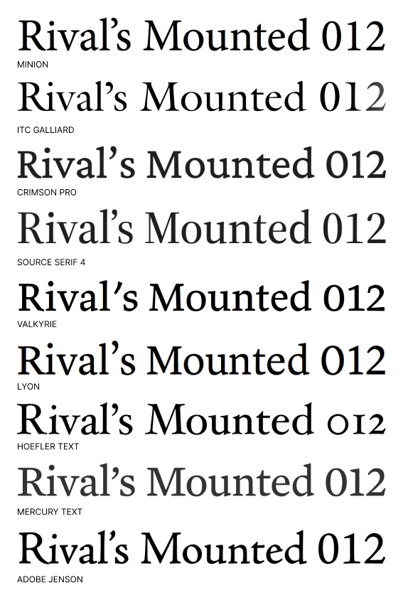
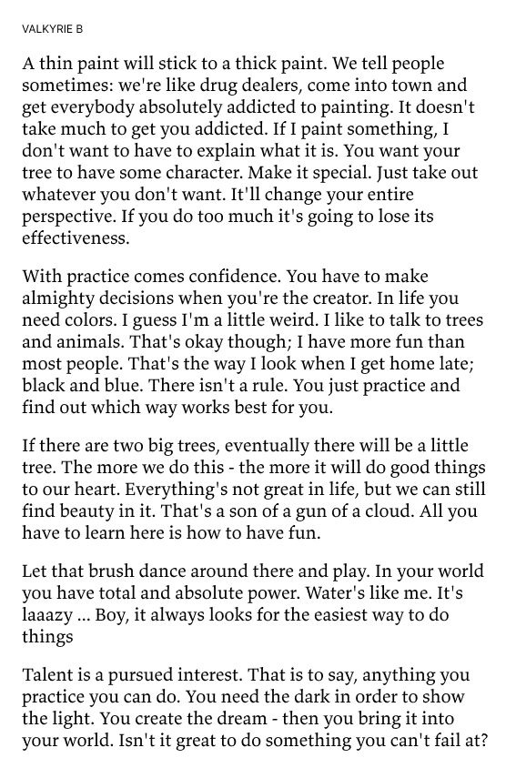

There are too many ways to choose type for a project, honestly. Some of them are technical, some are historical, and some amount to a designer staring at two perfectly good options until one feels slightly less wrong. Sometimes a free typeface is exactly right. Sometimes the right one is worth paying for. Either way, I think there are better ways to choose than just calling one “clean” and moving on.

A few weeks ago I was helping an unnamed client tune up a website that already had good writing, good photos, and a clear offer. But the whole thing still felt slightly off. We changed one typeface pairing and suddenly the tone matched the project. Nothing else changed. It just clicked.

In this post, I will share five story-first tests you can use to choose type when technical criteria alone are not enough.

<aside>

**Note**: I will use the word type and fonts interchangeably in this post. There is no real difference unless you just want to sound fancy by using the words typography and type. 

</aside>

## Where this usually shows up

Look at these type specimens. I used them to choose my e-reader font. I did look closely at curves and serifs, but that was not the deciding factor. I chose Valkyrie partly to support [Butterick's Practical Typography](https://practicaltypography.com/), which I have referenced for years. A good resource like this really helps inform your taste. You pick up knowledge along the way and that helps give you confidence in your choices. 

In the specimines below we can learn how different cuts, A and B, are made to support printing on different qualities of paper. Maybe that helps us decide which cut is better for an e-ink display. 

  <figure>
    
    <figcaption>9 fonts considered for use in my e-reader</figcaption>
  </figure>
  <figure>
    
    <figcaption>Valkarie typeface version A</figcaption>
  </figure>
  <figure>
    
    <figcaption>Valkarie typeface version B</figcaption>
  </figure>

My e-reader choice is one small example. The same story-first reasoning shows up in places like these:

- Personal or professional website or email newsletter
- Coding, writing, or generally working
- Business papers
- Cover letter or a resume
- Marketing materials like a post card or a poster

Most of these are “small” decisions that quietly become daily decisions. If you are staring at text for hours, the type is part of your mood, your pace, and your confidence. That is why this matters even when nobody else can name the font.

## When type disappears, it is working

A good typeface disappears. If you are designing a website for an HVAC repair technician, you are probably not using fonts that feel like a fashion magazine. The type should feel like it belongs before anyone notices it.

That does not mean boring. It means appropriate. The voice can be warm, stern, playful, or technical, but it should feel like the same person who wrote the words.

The traditional approach starts with style labels: serif vs sans-serif, decorative, gothic, old-style, humanist, geometric. Useful, yes. But this post is not a full typography class. You can read [Thinking with Type](https://ellenlupton.com/Thinking-with-Type) by Ellen Lupton, or one of the books in the list below, for that.

## Why bother choosing at all

What this post is about is some alternative ways to choose. A choice is important because just going with the default is a [non-choice](https://practicaltypography.com/minion-alternatives.html). Choose so that you can seek inspiration, have a point-of-view, or justify the value of your work. 

Also, a good story works better than an academic argument or design snobbery (I say this because I am guilty). The useful alternative is plain language. As designers [1] we are taught to speak simply, because [because Design-isms](https://uxdesign.cc/poster-prompts-for-avoiding-design-isms-8be43625c482). So when you explain your type choices, you can do that too.

In practice, this helps with clients, collaborators, and your future self. “I chose this because x-height and modulation” is fine. "I chose this because it sounds like your voice when read out loud" usually lands better.

## Five story-first ways to choose type

- **Test 1: Does this type connect to the project's context?** A lot of typefaces are quiet homages to specific places and eras. A font may have been created by a foundary from a certain place. I used that on a site for an author with roots in Argentina. She can now say that her typeface has roots in Argentina too.
- **Test 2: Does the name of the typeface help you explain the choice?** That same author had a character named Manu in one of her stories, so [Manuale](https://www.omnibus-type.com/fonts/manuale/) created a useful thread. For non-designers, this matters because memorable logic makes feedback and approval easier.
- **Test 3: Can you start from a trusted pairing instead of inventing one?** Many foundries publish pairings that were designed together. I still use a Hoefler and Co. capsule with Gotham, Decimal, and Operator Mono across resumes, note cards, and editor themes. For everyday teams, this matters because it lowers risk and speeds up decisions.
- **Test 4: Will this family hold up across real use cases?** Better families include text cuts, display cuts, figure styles, and OpenType options. Those details help when one system has to work in long-form reading, UI labels, and small utility text. For general readers, this matters because consistency reduces friction.
- **Test 5: Is it readable and fast for the audience?** Sometimes a system font or common web font is the right choice because it loads quickly and predictably. See this practical [Smashing Magazine post](https://www.smashingmagazine.com/2015/11/using-system-ui-fonts-practical-guide/). For non-designers, this matters because better accessibility and performance usually beat novelty.

<aside>

**Hot tip**: Let the type designer do the hard work for you. A quality typeface can hold a brand. This means you can rely less on other design elements like color or graphics. Your subject will be recognizable just by the type.

</aside>

Once you choose a typeface, let it do the work. If you are constantly decorating around it, the choice probably is not pulling its weight yet.

## Fonts to try

### Coding

- [Monospace](https://monaspace.githubnext.com/)
- [Operator Mono](https://www.typography.com/blog/introducing-operator)
- [Mononoki](https://madmalik.github.io/mononoki/)
- [Fira Code](https://github.com/tonsky/FiraCode)
- [Cascadia Code](https://github.com/microsoft/cascadia-code)
- [MonoLisa](https://www.monolisa.dev/)

### Writing

For drafting, the type should stay quiet: easy to read at a glance, hard to mistake for “design,” and fast enough that you keep moving. These are good places to start.

- [iA Writer Quattro](https://github.com/iaolo/iA-Fonts) — built for focused writing apps; neutral and low-contrast
- [Charter](https://fonts.adobe.com/fonts/charter) — screen-tuned serif; comfortable for long sessions without feeling editorial
- [Literata](https://fonts.google.com/specimen/Literata) — open source; made for sustained reading and writing on screens
- [IBM Plex Sans](https://fonts.google.com/specimen/IBM+Plex+Sans) — clear, even rhythm; good when you want sans without UI gimmicks
- [Source Sans 3](https://fonts.adobe.com/fonts/source-sans-3) — a reliable workhorse; pairs naturally with Source Serif if you read in one and write in the other
- [Atkinson Hyperlegible](https://fonts.google.com/specimen/Atkinson+Hyperlegible) — letterforms designed for clarity first; low visual noise
- [Lexend](https://fonts.google.com/specimen/Lexend) — spacing tuned for reading speed; helpful when you want the page to feel “quick”
- [Equity](https://mbtype.com/fonts/equity/) — Butterick’s text family; distraction-free and opinionated in a good way
- [Newsreader](https://fonts.google.com/specimen/Newsreader) — literary serif that still feels plain enough for everyday drafting

### Reading

- [Minion](https://fonts.adobe.com/fonts/minion)
- [ITC Galliard](https://fonts.adobe.com/fonts/itc-galliard)
- [Crimson Pro](https://fonts.google.com/specimen/Crimson+Pro)
- [Source Serif 4](https://fonts.adobe.com/fonts/source-serif-4)
- [Valkyrie](https://mbtype.com/fonts/valkyrie/)
- [Lyon](https://commercialtype.com/catalog/lyon_text)
- [Hoefler Text](https://www.typography.com/fonts/hoefler-text)
- [Mercury Text](https://www.typography.com/fonts/mercury-text/overview)
- [Adobe Jenson](https://fonts.adobe.com/fonts/adobe-jenson)

## Notes

[1] By the way, [everyone is a designer](#) and everything is designed. It’s just a matter of… was the design intentional or not. 

## Further Reading

Pick even one title from this list and you’ll come away with a sharper eye and even more ways to explain away your type choices.

<ol class="bookshelf">

<li class="filter-grid-item">
  
  

    <h3>{{ book.title }}</h3>
    
{{ book.author }}

  

</li>

</ol>

More fun links:
 - [Coding font game](https://www.codingfont.com/)

